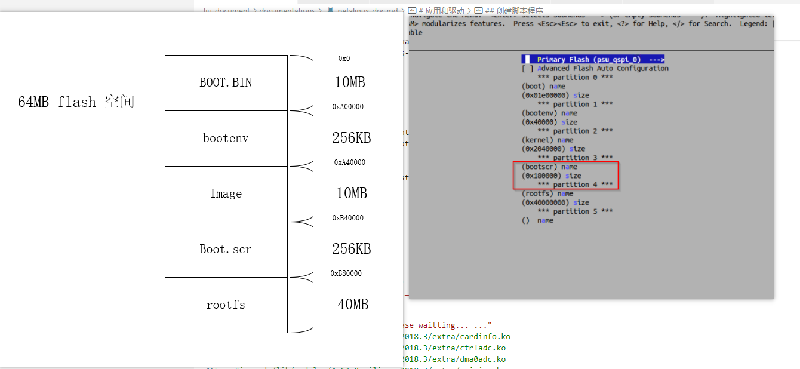

## 2024.5.6

petalinux2021.2使用QSPI启动：

\#\# 打包2021.2版本

ramdisk模式：

\> petalinux-package --boot --force --format BIN --fsbl --pmufw --u-boot --kernel images/linux/Image --offset 0x1E40000 --cpu a53-0 --boot-script --offset 0x3E80000 --add images/linux/rootfs.cpio.gz.u-boot --offset 0x4000000 --cpu a53-0 --file-attribute partition_owner=uboot

vcu版本：

flash设置：

petalinux-package --boot --force --format BIN --fsbl --pmufw --u-boot --kernel images/linux/Image --offset 0x1E40000 --cpu a53-0 --boot-script --offset 0x3E80000
